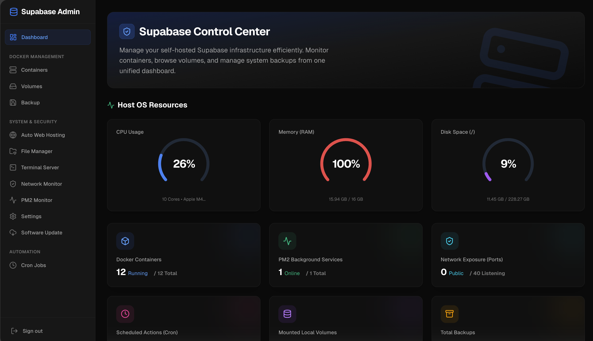

# Supabase Manager 🚀




A modern, comprehensive, and aesthetically pleasing web-based dashboard for managing self-hosted **Supabase** environments and generalized Docker/System infrastructures. Built entirely with Next.js 15 (App Router), React, and Tailwind CSS.

## ✨ Key Features

This project provides an all-in-one control center for your server.

**🐳 Docker Management**
* **Container Dashboard**: Start, stop, restart, and monitor real-time resource usage of Docker containers.
* **Container Inspector**: View deep underlying configurations, precise Environment Variables, volume Mounts, and Network hooks via `container.inspect()`.
* **Live Logs Output**: Stream real-time logs from any Docker container directly in the browser.
* **Volume Manager**: View, backup, and restore Docker volumes intuitively.

**💽 System & OS Operations**
* **Auto Web Hosting**: Seamlessly pull `.tar.gz` releases from your GitHub Repositories (Public/Private via PAT) and magically compile NGINX `.conf` server blocks binding your domain natively, now with global reverse proxy snippet support for API routing!
* **Web-Based Terminal Server**: Access a fully-featured shell environment right from your browser (powered by `node-pty` and `xterm.js`).
* **File Manager**: Explore, upload, download, move, copy, and delete system files via a Finder-like GUI.
* **Resource Monitor**: Beautiful Recharts-powered dial gauges displaying Live CPU, RAM, and Disk space usage.
* **Network & PM2 Monitor**: Track open network ports and PM2 node processes.

**⚡ Supabase Management**
* **Container & Image Updater**: Start, stop, and smoothly pull the latest Studio images without entering the CLI.
* **Edge Functions Deployer**: Native integration to pull compiled `functions.zip` releases directly from private GitHub repositories using PAT, extract into bind mounted Docker volumes, and automatically restart the edge-runtime.
* **Config Editor**: Safely modify the database's underlying `.env` secrets via the browser window equipped with Monaco Editor.

**⚙️ Automation & Backup**
* **Cron Job Scheduler**: Easily schedule, edit, and monitor recurring automated tasks (like volume snapshot/database backups).
* **Backup & Restore Hub**: Download `.tar.gz` backups locally or restore them with one click.
* **Auto Updater Pipeline**: Integrated CI/CD triggers allowing the application to self-update by pulling its own GitHub releases and reloading PM2.


## 🛠 Tech Stack

* **Framework:** [Next.js (App Router)](https://nextjs.org/)
* **Styling:** [Tailwind CSS](https://tailwindcss.com/) + Custom Glassmorphism Themes
* **Icons:** [Lucide React](https://lucide.dev/)
* **Charting:** [Recharts](https://recharts.org/)
* **File Manager Component:** [@cubone/react-file-manager](https://www.npmjs.com/package/@cubone/react-file-manager)
* **Terminal Emulator:** [Xterm.js](https://xtermjs.org/) + Socket.IO

---

## 🚀 Quick Start / Installation

### 1. Prerequisites
Ensure your host machine has the following tools installed:
* Node.js `v18+` or newer
* Docker & Docker Compose
* PM2 (optional, but recommended for daemonizing the web app)

### 2. Clone the Repository
```bash
git clone https://github.com/your-username/supabase-manager.git
cd supabase-manager
```

### 3. Install Dependencies
```bash
npm install
# or
yarn install
```

### 4. Setup Environment Variables
Copy the `.env.example` file (if provided) or create a new `.env` file at the root:
```env
# Security
JWT_SECRET=generate_your_secure_random_string_here
CRON_SECRET=your_secret_key_for_cron_jobs
```

> **Note:** The default login credentials are `admin` / `admin`. You must change this password immediately via the **Settings UI** in the dashboard. Other configurations like `BACKUP_DIR` and `FILE_MANAGER_ROOT` are also managed directly from the dashboard and securely stored in the local SQLite database.

### 5. Build and Run (Production)
```bash
npm run build
npm start

# Alternatively, run via PM2 for background process:
# pm2 start npm --name "supabase-manager" -- start
```
The dashboard will be accessible locally at `http://localhost:3000`.

---

### 🚦 6. Exposing the Manager (Deployment Options)
For security, the manager runs on port `3000` locally. If your server is behind a strict firewall (like a university or corporate network) or you want to access it securely from the outside, you have **3 recommended options**:

**Option A: NGINX Reverse Proxy (Recommended for Public Domains)**
If you own a domain and can configure DNS:
1. Setup a domain (e.g., `manager.yourdomain.com`).
2. Create an NGINX config handling SSL (Let's Encrypt).
3. Proxy traffic to the internal app:
   ```nginx
   server {
       listen 443 ssl;
       server_name manager.yourdomain.com;
       # ... SSL certificates ...
       location / {
           proxy_pass http://localhost:3000;
       }
   }
   ```

**Option B: Cloudflare Tunnels (Best for Bypassing Firewalls)**
If your host is behind a strict NAT/Firewall (e.g., University IP `10.150.x.x`) and you cannot port-forward:
1. Install `cloudflared` on your server.
2. Authenticate and route traffic securely to `http://localhost:3000` via the Cloudflare Zero Trust Dashboard.
3. You get a public domain with HTTPS without touching NGINX.

**Option C: SSH Tunneling (Maximum Security / Private Access)**
If you don't need a domain and just want to access the manager temporarily from your personal computer:
1. Run this on your personal laptop/PC:
   `ssh -L 3000:localhost:3000 dmsuser@your_server_ip`
2. Open your browser and go to `http://localhost:3000`. The traffic is encrypted through the SSH tunnel directly to the server.

---

### 🌐 7. Auto Web Hosting Feature (Optional)
If you want to use the **Auto Web Hosting** feature (deploying sites directly from GitHub with automatic NGINX configuration), you no longer need to grant dangerous `sudoers` privileges.
For maximum security, the system will download and extract the repository code into your specified root directory. It will then generate an NGINX `.conf` file in `/tmp/` and display a UI Modal containing the exact safe CLI commands you must run manually as `sudo` to enable the site.

> [!CAUTION]
> **NEVER Deploy directly from Source Code if your repository contains sensitive files (`.env`, config secrets).**
> By default, GitHub's Source Code Tarball includes *everything* in your branch. If you deploy it directly to a public NGINX folder, your `.env` files may become publicly readable!
> 
> **Best Practice:** You must use GitHub Actions (`release.yml`) to compile your application and package only the public-facing files (e.g., the `dist/` or `out/` folder) into an asset named `build.tar.gz`. The Hosting Dashboard will automatically detect `.tar.gz` and `.zip` Assets inside your releases and prioritize them over raw source code to keep your server secure!

### ⚡ 8. Edge Functions Deployment Guide
To utilize the **Edge Functions Deployer**, your GitHub repository must be configured to compile and attach your Supabase functions as a `.zip` artifact directly into GitHub Releases.

**Example GitHub Actions Workflow (`.github/workflows/release_functions.yml`):**
```yaml
name: Release Edge Functions
on:
  push:
    tags:
      - 'v*.*.*' # Triggers when a new version tag is pushed

jobs:
  build-and-release:
    runs-on: ubuntu-latest
    steps:
      - name: Checkout Code
        uses: actions/checkout@v3

      - name: Zip Functions
        run: |
          cd supabase/functions
          zip -r ../../functions.zip ./*

      - name: Upload Release Asset
        uses: softprops/action-gh-release@v1
        with:
          files: functions.zip
        env:
          GITHUB_TOKEN: ${{ secrets.GITHUB_TOKEN }}
```

**Setup in Dashboard:**
1. Navigate to **System Settings**.
2. Enter your `SUPABASE_FUNCTIONS_REPO` (e.g., `owner/repo`).
3. Enter your `SUPABASE_FUNCTIONS_PAT` (Personal Access Token). Requires `repo` permissions if private.
4. Navigate to **Hosting & Projects -> Edge Functions** to deploy the `functions.zip` artifact to your server natively!

---

### 🗄️ 9. Database Management Guide
The **Database Management** module works similarly to Edge Functions. It relies on GitHub Artifacts to safely deploy database changes without exposing your Supabase database ports to the internet.

Your GitHub Actions or Release workflow should `zip` the contents of your `supabase/migrations/` and `supabase/seed.sql` files into a single artifact named `database.zip`.

**Example Adding to GitHub Actions:**
```yaml
      - name: Zip Database
        run: |
          cd supabase
          zip -r ../database.zip migrations/ seed.sql

      - name: Upload Release Asset
        uses: softprops/action-gh-release@v1
        with:
          files: |
            functions.zip
            database.zip
```

**Setup in Dashboard:**
1. Configure your API token and Repo in **System Settings** (It shares the same settings as Edge Functions).
2. Navigate to **Hosting & Projects -> Database Tools**.
3. Select an Artifact. The system will download it, extract the SQL files, and query the internal `supabase_migrations.schema_migrations` table.
4. It will compare the files and indicate which are `Applied` vs `Pending`.
5. Click **Migrate All Pending** or run your **Seed**! All SQL executes safely over Docker internal copying (`docker cp`) preventing encoding corruption.

---

## 🔒 Security Warning

Because this dashboard grants full access to system files, docker daemons, and a terminal shell:
* **DO NOT** expose this dashboard to the public internet without putting it behind a strict reverse proxy (like Nginx/Traefik) with SSL and possibly an extra Layer of Basic Auth/VPN.
* Change your default `ADMIN_PASSWORD` immediately.

## 🤝 Contributing
Contributions, issues, and feature requests are always welcome! Feel free to check the [issues page](https://github.com/your-username/supabase-manager/issues).

## 📄 License
This project is [MIT licensed](LICENSE).
